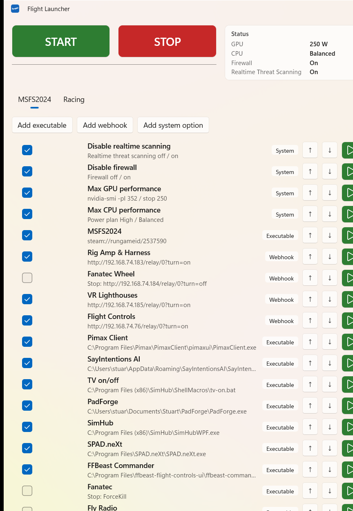

# FlightLauncher

<p align="center">
  
</p>

Windows desktop app that starts and stops a list of tasks for different profiles (default: Flight and Racing). It replaces ad-hoc batch files with an editable, ordered checklist you can run with one START or STOP click, from the tray, or from the command line.

## What it does

- Runs an ordered list of enabled tasks for the active profile.
- **START** walks the list top to bottom and performs each task's start action.
- **STOP** walks the list top to bottom and performs each task's stop action.
- Profiles (tabs) each have their own task list and display name.
- Settings are saved to `%AppData%\FlightLauncher\tasks.json`.

## Task types

### 1) Executable

- Launch an `.exe`, `.bat`, `.cmd`, URI (e.g. `steam://...`), or leave Path empty for stop-only rows.
- Working directory is set automatically to the file's folder.
- Options:
  - Run as administrator
  - Kill process before launching (optional Force)
  - On Stop: Kill, Force kill, or custom command line
- Kill image names support wildcards and comma-separated lists (e.g. `SPAD.neXt*`, `PimaxClient.exe`, `DeviceSetting.exe`).

### 2) Webhook

- HTTP GET Start URL and/or Stop URL (either may be empty).
- Useful for smart relays (e.g. `turn=on` / `turn=off`).

### 3) System (built-in)

- **Disable firewall**
  - Start: disable via `INetFwPolicy2` (all profiles)
  - Stop: enable via `INetFwPolicy2`
- **Disable Realtime Threat Scanning**
  - Start: `DisableRealtimeMonitoring=true` via `MSFT_MpPreference` (WMI)
  - Stop: `DisableRealtimeMonitoring=false`
  - Note: Windows Tamper Protection can block this; turn it off temporarily if the preference does not change.
- **Max CPU performance**
  - Start: `powercfg /s` High performance
  - Stop: `powercfg /s` Balanced (same command)
- **Max GPU performance**
  - Start: `nvidia-smi -pl <start watts>`
  - Stop: `nvidia-smi -pl <stop watts>` (same command; watts configurable)

## Main window

- Green **START** / red **STOP** buttons run the active profile.
- Status panel shows GPU power limit, CPU power plan, firewall, and realtime threat scanning (refreshes on load, every 5s, and after runs).
- Progress bar shows task progress while a run is in progress.
- Flight / Racing tabs (names are editable via Rename).
- Add executable / webhook / system option.
- Per row: enable checkbox, summary, move up/down, start/stop icons, delete, drag reorder.
- Double-click a row to edit.
- Edit dialog includes Test start action / Test stop action for one entry.
- Start on login checkbox registers/unregisters the app in HKCU Run.
- Log panel at the bottom.

## Tray

- Close or minimize hides the app to the system tray (does not exit).
- Double-click tray icon to show the window.
- Tray menu: Show, Start, Stop, Exit.
- Exit from the tray fully quits the app.

## Command line

Useful for scripts and shortcuts.

| Switch | Description |
| --- | --- |
| `--profile flight\|racing` | Select profile (aliases: `--mode`, `-p`, `--flight`, `--racing`) |
| `--start` | Run START for the selected/active profile |
| `--stop` | Run STOP for the selected/active profile |
| `--exit` | Exit after `--start`/`--stop` completes |
| `--minimized` | Start hidden in the tray |
| `--help` | Show help in the log |

Examples:

```text
FlightLauncher.exe --profile flight --start --exit
FlightLauncher.exe --racing --stop --exit
FlightLauncher.exe -p flight --start
```

## Notes

- Admin actions (firewall, Defender, some kills, `nvidia-smi`) may show UAC prompts. Firewall/Defender use in-process COM/WMI (no console window); if the app is not elevated it relaunches itself briefly for those jobs.
- Soft Kill may not close apps that ignore close requests; Force Kill uses `taskkill /F /T` and can retry elevated if needed.
- Profile tab names are stored in `tasks.json` as `modes[].name`. CLI and internal ids remain `flight` and `racing`.
- First launch seeds a Flight list inspired by typical `flight.bat` / `off.bat` workflows; Racing starts empty.

## Build / run

```powershell
dotnet build FlightLauncher.csproj -c Debug -p:Platform=x64
```

Output:

```text
bin\x64\Debug\net9.0-windows10.0.26100.0\win-x64\FlightLauncher.exe
```

## Installer (simplest)

FlightLauncher is unpackaged WinUI. The simplest way to avoid installing .NET Desktop Runtime and Windows App SDK separately is a self-contained publish (bundles both), then optionally wrap it with Inno Setup.

### 1) Publish (no third-party tools)

```powershell
powershell -ExecutionPolicy Bypass -File .\publish.ps1
```

Output folder: `artifacts\publish\win-x64\`

You can zip that folder and run `FlightLauncher.exe` from it. The publish step must include `FlightLauncher.pri` and the `.xbf` XAML binaries (verified by `publish.ps1`).

### 2) Optional Setup.exe (requires Inno Setup 6)

- Download: https://jrsoftware.org/isinfo.php
- Run `publish.ps1` first
- Open `installer\FlightLauncher.iss` in Inno Setup Compiler
- Build

Output: `artifacts\installer\FlightLauncherSetup.exe`

The installer copies the self-contained build, adds Start Menu / optional Desktop shortcuts, and supports uninstall. It does not need a separate .NET or Windows App SDK install on the target PC.

## GitHub Actions

Workflow file: `.github/workflows/build.yml`

On push/PR to `master` or `main` (and via **Run workflow**), GitHub:

1. Restores and builds Release x64
2. Runs `publish.ps1` (self-contained win-x64)
3. Builds `FlightLauncherSetup.exe` with Inno Setup
4. Uploads two artifacts:
   - `FlightLauncher-win-x64` (folder you can zip/run)
   - `FlightLauncherSetup` (Setup.exe)

In the GitHub repo: **Actions** → select the workflow run → **Artifacts**.

To publish a release from CI later, add a release job that attaches those artifacts to a GitHub Release tag.
